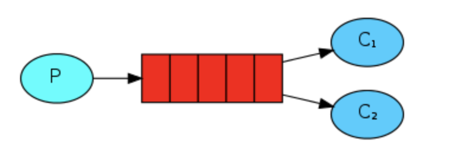

# RabbitMQ_Application
 
## Introduction - Creating "Hello World" and Setting up RabbitMQ
_Visit https://www.rabbitmq.com/getstarted.html_

### Step 1: Creating a Sender 
The publisher will connect to RabbitMQ, send a single message, then exit
- Create a connection which will generate a RabbitMQ node on the local machine
- Create a channel, which is where most of the API for getting things done resides
- To send, we must declare a queue for us to send to
- Publish a message to queue


### Step 2: Creating a Receiver
Consumer listens for messages from RabbitMQ.
- Declare the queue (Because we might start the consumer before the publisher, we want to make sure the queue exists before we try to consume messages from it)
- Write a try-with-resource statement to automatically close the channel and the connection
- Provide a callback in the form of an object that will buffer the messages until we're ready to use them


### Step 3: Putting it all together

You can compile both of these with just the RabbitMQ java client on the classpath:
```javac -cp amqp-client-5.7.1.jar Send.java Recv.java ```

To run them, you'll need rabbitmq-client.jar and its dependencies on the classpath. In a terminal, run the consumer (receiver):
```java -cp .:amqp-client-5.7.1.jar:slf4j-api-1.7.26.jar:slf4j-simple-1.7.26.jar Recv```

then, run the publisher (sender):
```java -cp .:amqp-client-5.7.1.jar:slf4j-api-1.7.26.jar:slf4j-simple-1.7.26.jar Send```

---
## Work Queues
Create a Work Queue that will be used to distribute time-consuming tasks among multiple workers.



> [Round-robin dispatching] The main idea behind Work Queues (aka: Task Queues) is to avoid doing a resource-intensive task immediately and having to wait for it to complete. Instead we schedule the task to be done later. We encapsulate a task as a message and send it to a queue. A worker process running in the background will pop the tasks and eventually execute the job. When you run many workers the tasks will be shared between them.

- **Message acknowledgment:** If the consumer dies, ensure the message is never lost using message acknowledgment; RabbitMQ will understand that a message wasn't processed fully and will re-queue it. If there are other consumers online at the same time, it will then quickly redeliver it to another consumer.
- **Message durability:** If the server crashes; Two things are required to make sure that messages aren't lost: we need to mark both the queue and messages as durable.
- **Fair dispatch:** When RabbitMQ dispatches a message when the message enters the queue. It just blindly dispatches every n-th message to the n-th consumer. Make sure that each worker receives one message at a time.
